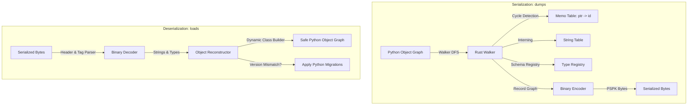

# Rust Engine & PyO3 Architecture

`pysafe-pickle` is built as a compiled Rust cdylib extension module using PyO3 and Maturin.

---

## High-Level Pipeline

---

## 1. DFS Object Traversal (`traversal.rs`)
The `Walker` traverses the Python object graph using depth-first search:
- Inspects Python object type strings.
- Replaces duplicate pointers with `Record::Reference(id)` to prevent infinite loops and preserve identical object topologies.
- Unknown or dangerous types (e.g. modules, functions) immediately trigger `UnsafeTypeError` inside Rust before writing any bytes.

---

## 2. ABI3 Wheel Distribution
`pysafe-pickle` targets PyO3's `abi3-py310` feature:
- A single pre-built wheel runs across Python 3.10, 3.11, 3.12, 3.13, and future Python 3.x minor releases without recompilation.
- Zero local C/Rust compiler requirement for end users.
