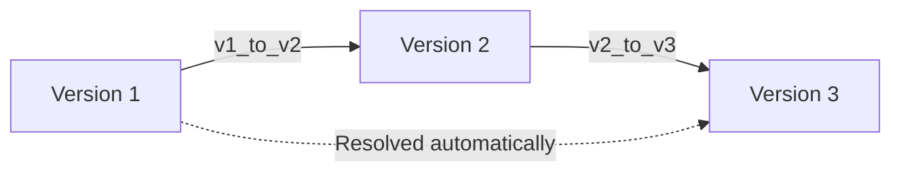

# Schema Evolution & Migrations

In long-running production systems, data models change over time. When stored data needs to be read months or years later, changes in class definitions often lead to deserialization errors.

`pysafe-pickle` provides **first-class schema evolution**:
- Each dataclass can declare its schema version via `__pysafe_pickle_version__`.
- The version is embedded into the binary type table (4 bytes per type).
- Migration functions registered via `@psp.migrate(...)` automatically bridge gaps between versions at deserialization time.

---

## Defining Versioned Dataclasses

Assign `__pysafe_pickle_version__` (or the legacy attribute `__pygraph_version__`) to your dataclass:

```python
from dataclasses import dataclass
import pysafe_pickle as psp

@dataclass
class User:
    name: str
    age: int
    email: str = ""
    __pysafe_pickle_version__ = 2
```

When an instance of `User` is serialized with `psp.dumps()`, the type table records:
- Type Name: `"User"`
- Fields: `["name", "age", "email"]`
- Schema Version: `2`

---

## Registering Migrations

Use the `@psp.migrate` decorator to define migration functions that transform the dictionary state from one version to another:

```python
import pysafe_pickle as psp

# Migrate User state from Version 1 -> Version 2
@psp.migrate(from_version=1, to_version=2, type_name="User")
def migrate_user_v1_to_v2(state: dict) -> dict:
    """V1 had 'name' + 'age'; V2 added 'email'."""
    state["email"] = "unknown@domain.com"
    state["__pysafe_pickle_version__"] = 2
    return state

# Migrate User state from Version 2 -> Version 3
@psp.migrate(from_version=2, to_version=3, type_name="User")
def migrate_user_v2_to_v3(state: dict) -> dict:
    """V2 added 'email'; V3 adds 'phone' and formats email."""
    state["phone"] = ""
    state["email"] = state.get("email", "").lower()
    state["__pysafe_pickle_version__"] = 3
    return state
```

### Migration Function Contract

A migration function:
1. Receives `state: dict` containing the serialized fields of the object.
2. Modifies or constructs a new `dict`.
3. Returns the transformed dictionary.

---

## Automated Chain Resolution

`pysafe-pickle` automatically discovers the optimal migration path using a greedy resolution algorithm.



If an object was serialized under **Version 1**, and the application's current class is at **Version 3**:
1. The Rust decoder detects `serialized_version (1) != current_version (3)`.
2. Python resolves the chain: `v1 → v2 → v3`.
3. The migrations execute sequentially, transforming the state dictionary.
4. The final state is reconstructed into the current `User` dataclass instance.

---

## Forward Compatibility & Extra Fields

If a newer object (e.g. Version 2) is read by an older system that only knows Version 1:
- Any extra fields that do not exist on the older class definition are stored in `__pysafe_pickle_extra__`.
- No data is lost during deserialization.
